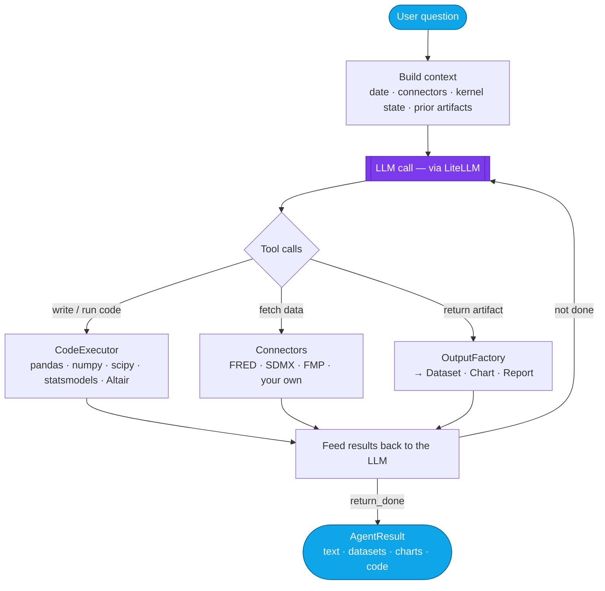

# parsimony-agents

**Build AI agents that discover, fetch, and analyze data through code**

[](https://pypi.org/project/parsimony-agents/)
[](https://pypi.org/project/parsimony-agents/)
[](LICENSE)
[](https://github.com/ockham-sh/parsimony-agents/actions/workflows/test.yml)

<p align="center">
  
</p>

`parsimony-agents` is a lightweight Python **framework** for building **code-generating data-analysis agents** — something you import, not a platform you adopt. Instead of guessing at answers, the agent reasons in *code*: it discovers the data it needs through pluggable connectors, writes Python to fetch and analyze it, executes that code, inspects the results, and iterates until it has a real answer — returning typed datasets, charts, and reports along the way.

You bring the pieces and the framework runs the loop that ties them together: **any LLM** (100+ providers via [LiteLLM](https://docs.litellm.ai/)), your data connectors, and your execution environment. It runs **in-process** — pure async Python, no service to stand up, no vendor lock-in — and exposes both a one-line `ask()` API and a full streaming event API for building custom UIs.

```python
from parsimony_agents import Agent, stream_to_display
from parsimony_fred import CONNECTORS as FRED

agent = Agent(
    model="claude-sonnet-4-6",
    connectors=FRED.bind(api_key="..."),
)

result = await stream_to_display(
    agent,
    "What is the current US unemployment rate? Fetch the data and chart it since 2020.",
)
```

---

## Why parsimony-agents?

- **Code-first, not chat-first.** The agent writes and executes real Python (pandas, numpy, scipy, statsmodels, Altair) against your data. Answers are computed, reproducible, and auditable — every result carries the notebook that produced it.
- **Bring your own model.** No vendor lock-in. Point it at Claude, GPT, Gemini, a local Ollama model, Bedrock, Azure — anything LiteLLM supports — with one string.
- **Data sources are pluggable.** Connectors (FRED, SDMX, FMP, or your own) are first-class. The agent discovers what's available and composes them on the fly.
- **Typed artifacts, not raw text.** Results come back as structured `Dataset`, `Chart`, and `Report` objects with provenance and content-addressed identity — built to persist, refresh, and embed in applications.
- **A real failure-handling spine.** A structured failure taxonomy and recovery policy (retry / hand off / suspend / terminate) replaces ad-hoc retry loops. The agent can even suspend to ask the user a question and resume later.
- **Two ways to consume.** Use `ask()` for a complete result in one call, or `run()` to stream every event (text deltas, tool progress, errors) into your own interface.
- **In-process and lightweight.** Pure async Python — no HTTP server, no web framework, no background workers required to get started.

## Installation

```bash
pip install parsimony-agents
```

Optional feature sets (extras):

| Extra | Install | Enables |
|---|---|---|
| `display` | `parsimony-agents[display]` | Rich terminal output (tables, spinners, syntax-highlighted code) |
| `rag` | `parsimony-agents[rag]` | Hybrid keyword + semantic retrieval (ChromaDB + Tantivy) for long sessions |
| `sql` | `parsimony-agents[sql]` | In-agent SQL via DuckDB |
| `documents` | `parsimony-agents[documents]` | Read PDF, Excel, and PowerPoint files |
| `all` | `parsimony-agents[all]` | Everything above |

Requires Python 3.11 or 3.12.

## Quick start

The example below uses [FRED](https://fred.stlouisfed.org/docs/api/api_key.html) (free API key) as a data source. You can swap in any connector.

```bash
pip install "parsimony-agents[display]" parsimony-fred
export ANTHROPIC_API_KEY="sk-ant-..."   # or any LiteLLM-supported provider
export FRED_API_KEY="..."               # free key from the link above
```

```python
import asyncio
import os

from parsimony_agents import Agent, stream_to_display
from parsimony_fred import CONNECTORS as FRED


async def main() -> None:
    agent = Agent(
        model="claude-sonnet-4-6",
        connectors=FRED.bind(api_key=os.environ["FRED_API_KEY"]),
    )

    # Ask a question — renders the agent's work live in the terminal
    result = await stream_to_display(
        agent,
        "What is the current US unemployment rate? Fetch the data and show me.",
    )

    # Follow up in the same conversation by reusing the context
    result = await stream_to_display(
        agent,
        "Now show me how it has changed since 2020.",
        ctx=result.context,
    )


asyncio.run(main())
```

Prefer no terminal rendering? `agent.ask()` returns the same structured result in one line:

```python
result = await agent.ask("How has US unemployment changed since 2020?")

print(result.text)                     # the agent's written answer
print(result.datasets.keys())          # returned Datasets (DataFrames + metadata)
print(result.charts.keys())            # returned Charts (Vega-Lite specs)
print(result.ok)                       # True if the run finished without errors
result.context                          # pass to the next call for multi-turn
```

## Bring your own model

The `model` argument is a LiteLLM model identifier — switching providers is a one-line change:

```python
Agent(model="claude-sonnet-4-6", api_key="sk-ant-...")        # Anthropic
Agent(model="gpt-4o", api_key="sk-...")                        # OpenAI
Agent(model="gemini/gemini-3-flash-preview", api_key="...")    # Google
Agent(model="ollama/llama3.1")                                 # local, no key
```

For advanced control (temperature, max tokens, base URLs, and other LiteLLM
params) pass a `model_config` dict instead of `model`. See the
[LiteLLM provider docs](https://docs.litellm.ai/docs/providers) for the full list.

## Composing data sources

Connectors are pluggable and composable. Merge several into a single agent:

```python
from parsimony import Connectors
from parsimony_fred import CONNECTORS as FRED
from parsimony_sdmx import CONNECTORS as SDMX
from parsimony_fmp import CONNECTORS as FMP

connectors = Connectors.merge(
    FRED.bind(api_key="..."),   # US economic data (Federal Reserve)
    SDMX,                       # international statistics (Eurostat, IMF, ...)
    FMP.bind(api_key="..."),    # company financials & market data
)

agent = Agent(model="claude-sonnet-4-6", connectors=connectors)
```

The agent auto-discovers the available connectors, picks the right one for each
question, and memoizes fetches within a session to avoid redundant API calls.
Connector results are typed and the fetch log is recorded in the produced
notebook for a full audit trail. Build your own connectors with
[`parsimony-core`](https://github.com/ockham-sh/parsimony) — see
[parsimony-connectors](https://github.com/ockham-sh/parsimony-connectors) for examples.

## Streaming events

For custom UIs, websockets, or metrics, drive the agent with `run()` and handle
events as they arrive:

```python
from parsimony_agents import Agent, AgentResult

agent = Agent(model="claude-sonnet-4-6", connectors=...)

result = AgentResult()
async for event in agent.run("What is the current US unemployment rate?"):
    result._collect(event)  # accumulate while you process

    match event.type:
        case "text_delta":
            print(event.content, end="", flush=True)
        case "tool_event" if not event.completed:
            print(f"\n  -> {event.tool_name}...", end="", flush=True)
        case "tool_event" if event.completed:
            print(f" done ({event.ui_message_completed or 'ok'})")
        case "error":
            print(f"\n[error] {event.message} (recoverable={event.recoverable})")

print(result.datasets.keys(), result.charts.keys(), result.ok)
```

See [`examples/`](examples/) for complete, runnable scripts.

## How it works



The agent runs a tool-driven loop: it builds a snapshot of the current
environment, calls the LLM, dispatches the resulting tool calls (write/run code,
return a dataset or chart, read files or data), feeds the outputs back, and
repeats until it explicitly finishes. Generated code runs in an **in-process
Python kernel** (`CodeExecutor`) with a serialized execution lock; outputs are
classified by an `OutputFactory` into typed artifacts.

> **Security note:** the built-in executor runs agent-generated Python
> **in-process** and does **not** sandbox imports. For untrusted workloads, run
> it inside a container or supply your own isolated executor. See
> [`SECURITY.md`](SECURITY.md).

## Artifacts

Every run can produce typed, persistable artifacts:

- **`Dataset`** — a DataFrame plus metadata and provenance (where the data came from).
- **`Chart`** — an Altair / Vega-Lite visualization, themed and serializable to spec, image, or HTML (via `vl-convert`).
- **`Report`** — a composed narrative document combining text, datasets, and charts.
- **`Script`** — the executable notebook the agent built, so any result is reproducible.

Artifacts use a dual-identity model — a stable `logical_id` ("which artifact")
and a `content_sha` ("what it currently looks like") — so they can be refreshed,
deduplicated, and tracked across turns. I/O helpers (`read_dataset`,
`serialize_chart`, `save_notebook`, …) are exported from the top-level package.

## Documentation

| Doc | What's inside |
|---|---|
| [docs/INDEX.md](docs/INDEX.md) | Documentation hub — start here |
| [docs/API.md](docs/API.md) | Full API reference (`Agent`, `AgentResult`, artifacts, tools) |
| [docs/ARCHITECTURE.md](docs/ARCHITECTURE.md) | System design, the agent loop, extension points |
| [docs/RUNBOOK.md](docs/RUNBOOK.md) | Deployment, configuration, monitoring, troubleshooting |
| [docs/COMMANDS.md](docs/COMMANDS.md) | Development workflow and commands |
| [examples/](examples/) | Runnable examples (`quickstart.py`, `event_stream.py`) |

## The Parsimony ecosystem

`parsimony-agents` is part of the open-source **Parsimony** stack for agent-native data analysis:

- **[parsimony](https://github.com/ockham-sh/parsimony)** (`parsimony-core`) — the connector protocol and typed result model.
- **[parsimony-connectors](https://github.com/ockham-sh/parsimony-connectors)** — ready-made data connectors (FRED, SDMX, FMP, …).
- **parsimony-agents** *(this repo)* — the code-generating analysis agent.
- **[Ockham Terminal](https://github.com/ockham-sh/terminal)** — the full agentic data-analysis workspace built on top of this library.

## Contributing

Contributions are welcome! See [CONTRIBUTING.md](CONTRIBUTING.md) for development
setup and guidelines, and [CODE_OF_CONDUCT.md](CODE_OF_CONDUCT.md) for community
standards. In short:

```bash
git clone https://github.com/ockham-sh/parsimony-agents.git
cd parsimony-agents
uv venv && source .venv/bin/activate
uv pip install -e ".[all]"

uv run pytest tests/ -v        # tests
uv run ruff check .            # lint
uv run mypy parsimony_agents/  # type-check
```

## Security

Found a vulnerability? Please **do not** open a public issue — email
**security@ockham.sh**. See [SECURITY.md](SECURITY.md) for the full policy.

## License

Apache License 2.0 — see [LICENSE](LICENSE). Built by [Ockham](https://ockham.sh).
