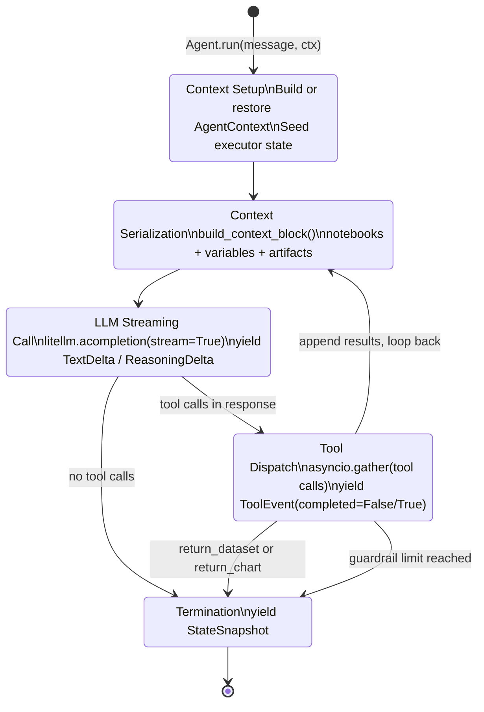
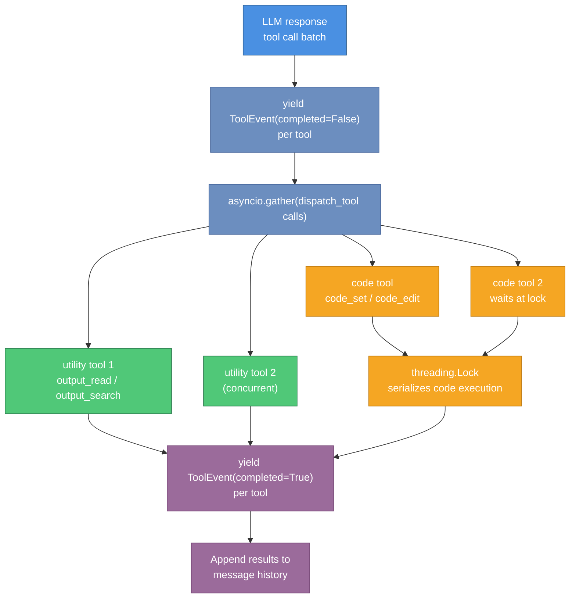
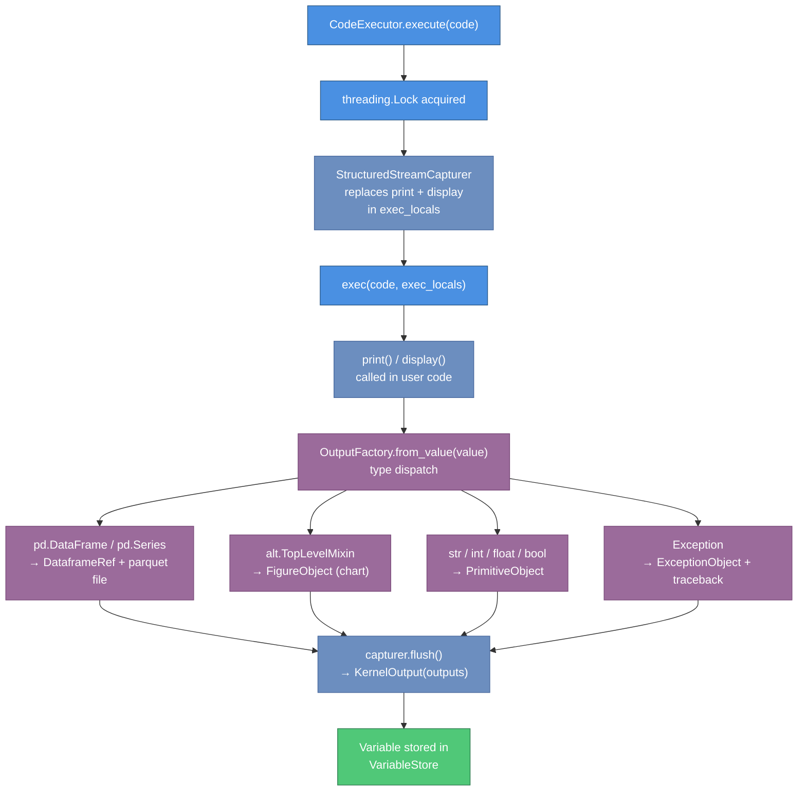
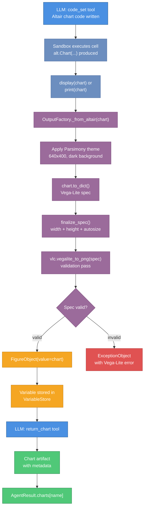

# parsimony-agents Architecture

System design, components, data flow, and implementation details for developers who need to extend, debug, or maintain the library.

This document covers both the high-level design (components and data flow) and the technical deep-dive on internal implementation (agent loop, tool dispatch, execution engine, and streaming protocol).

## Overview

`parsimony-agents` is a Python library — not a server. It has no HTTP listeners and no web framework. All interaction is through Python function calls and an async generator interface.

The library's job is to bridge three things:

1. A user's natural language question
2. An LLM (via litellm) that reasons and calls tools
3. A Python sandbox that executes code and captures outputs

The agent loop connects them: it serializes the conversation state into an LLM-readable context block, sends it to the LLM, dispatches the tool calls the LLM requests, and feeds results back into the next iteration.

## Core Components

### 1. Agent (`parsimony_agents/agent/`)

The main orchestrator that manages the LLM loop, tool invocation, and execution state.

**Key classes:**
- `Agent` — Main entry point; orchestrates LLM calls, code execution, and artifact management
- `AgentResult` — Structured response containing natural language analysis, datasets, charts, and executed code

**Responsibilities:**
- Maintain multi-turn conversation state
- Invoke tools (code execution, artifact return, context inspection)
- Parse LLM responses and handle tool calls
- Track execution history and guardrails

### 2. CodeExecutor (`parsimony_agents/execution/executor.py`)

Sandboxed Python code execution engine that runs agent-generated code in-process.

**Key features:**
- In-process execution (no separate service required)
- Configurable working directory and environment
- Timeout enforcement
- Output capture and provenance tracking
- Safe namespace with allowed imports

**Configuration:**
```python
CodeExecutor(
    cwd="/tmp/work",              # Working directory
    output_factory=OutputFactory(),
    sandbox=True,                 # Enable/disable sandboxing
    allowed_imports=["pandas", ...] # Whitelist imports
)
```

### 3. Variable Store (`parsimony_agents/variable.py`)

Maintains execution state across multiple code executions.

**Features:**
- Tracks Python variables created during code execution
- Supports serialization/deserialization
- Enables multi-turn conversations with persistent state
- Provides variable inspection and context

### 4. Notebooks (`parsimony_agents/notebook.py`)

Organizes agent-generated code into editable, re-executable cells.

**Concepts:**
- **Script** — A named collection of code cells (immutable execution record)
- **Notebook** — Editable cells that can be modified and re-executed
- **Cell** — Individual code block with output and execution metadata

### 5. Artifacts (`parsimony_agents/artifacts/`)

Typed deliverables produced by the agent.

**Artifact types:**
- **Dataset** — Curated data with metadata, version, and provenance
- **Chart** — Altair/Vega-Lite visualization linked to source dataset
- **Table** — Formatted data table

### 6. Output Factory (`parsimony_agents/execution/factory.py`)

Dispatches execution outputs to appropriate artifact types.

**Responsibilities:**
- Detect output type (DataFrame, Chart, etc.)
- Instantiate appropriate Artifact class
- Manage artifact metadata and storage
- Handle serialization

### 7. RAG System (Optional, `parsimony_agents/rag/`)

Semantic search over agent outputs for multi-turn context.

**Components:**
- **VectorStore** — ChromaDB/Tantivy-backed semantic search
- **Embeddings** — Embedding model for vectorization
- **OutputProcessor** — Converts outputs to searchable documents

## Data Flow

```
User Query
    ↓
Agent.ask() / Agent.run()
    ↓
LLM Prompt + Tool Definitions
    ↓
LLM generates Tool Calls
    ↓
Tool Dispatch
    ├─ code_set → CodeExecutor → outputs → OutputFactory → Artifacts
    ├─ code_edit → Modify notebook cells
    ├─ return_dataset → Finalize Dataset artifact
    ├─ return_chart → Finalize Chart artifact
    └─ get_context → Return Variable state
    ↓
Outputs stored in VariableStore
    ↓
LLM synthesis
    ↓
AgentResult (text, datasets, charts, code)
```

## Key Design Patterns

### 1. Composable Data Sources

Data sources are plugged in via `parsimony` connectors:

```python
agent = Agent(
    connectors=(
        FRED.bind_deps(api_key="...")
        + SDMX
        + FMP.bind_deps(api_key="...")
    )
)
```

Agents discover available data sources via the MCP server or connectors list.

### 2. Dual Consumption Modes

**Ask mode** — Returns a complete structured result:
```python
result = await agent.ask("Question")
# Access: result.text, result.datasets, result.charts
```

**Stream mode** — Emits events as they occur:
```python
async for event in agent.run("Question"):
    if event.type == "text_delta":
        print(event.content, end="")
```

### 3. Provenance Tracking

Every data fetch is tagged with:
- **Source** — Connector and endpoint
- **Parameters** — Query arguments and timestamps
- **Metadata** — Response format, data types

Stored in `Dataset.provenance` and accessible in the execution context.

### 4. Multi-Turn State Management

State persists across calls via `VariableStore`:
- Previous code executions available as variables
- Notebooks are editable and re-executable
- Context can be inspected with `get_context` tool

## Extension Points

### Custom Connectors

Implement `parsimony.Connector` protocol to add data sources:

```python
class MyDataConnector(Connector):
    def discover(self) -> list[DataSource]:
        """Publish available datasets"""
    
    def fetch(self, source_id: str, **params) -> Result:
        """Execute a data fetch"""
```

### Custom Tools

Add application-specific tools via `Agent.tools` parameter:

```python
@tool
def my_tool(arg: str) -> str:
    """Tool description for LLM"""
    return f"Result: {arg}"

agent = Agent(tools=[my_tool], ...)
```

### Custom Output Types

Extend `Artifact` and register with `OutputFactory`:

```python
class MyArtifact(Artifact):
    type: Literal["my_artifact"] = "my_artifact"
    data: MyData

output_factory.register(MyArtifact)
```

## Configuration

### AgentConfig Bundle

For product integrations that reuse the same expert-level settings, `AgentConfig` consolidates 7 constructor parameters into a single dataclass:

```python
from parsimony_agents.agent import AgentConfig, AgentGuardrails

config = AgentConfig(
    model_config={"model": "claude-sonnet-4-6", "api_key": "..."},
    instructions="Custom system prompt...",
    code_executor=CodeExecutor(...),
    output_factory=OutputFactory(...),
    guardrails=AgentGuardrails(max_iterations=30),
    session_id="my-session",
    file_store=my_file_store,
)

agent = Agent(config=config, connectors=my_connectors)
```

Explicit keyword arguments always take precedence over `config` values, so you can override individual settings:

```python
# Uses config for everything except instructions
agent = Agent(config=config, instructions="Override prompt")
```

### Agent Configuration (direct kwargs)

All `AgentConfig` fields can also be passed directly as keyword arguments:

```python
agent = Agent(
    # LLM settings
    model_config={"model": "claude-sonnet-4-6", "api_key": "..."},
    
    # Execution settings
    code_executor=CodeExecutor(...),
    output_factory=OutputFactory(...),
    
    # Control settings
    guardrails=AgentGuardrails(
        max_iterations=30,
        max_execution_time_s=120.0,
        max_output_size_mb=100
    ),
    
    # Data sources
    connectors=my_connectors,
    
    # Behavior
    instructions="Custom system prompt...",
    tools=[...],
)
```

### Guardrails

Safety limits on agent execution:

| Setting | Default | Description |
|---------|---------|-------------|
| `max_iterations` | 30 | Max LLM turns before stopping |
| `max_execution_time_s` | 120.0 | Max total execution time |
| `max_output_size_mb` | 100 | Max output file size |
| `max_code_lines` | 500 | Max code lines per execution |

## Testing

### Unit Tests

Test individual components (tools, executors, artifacts):

```python
def test_code_executor():
    executor = CodeExecutor()
    result = executor.execute("x = 1 + 1", {})
    assert result.outputs["x"] == 2
```

### Integration Tests

Test end-to-end agent workflows with mock or real connectors:

```python
@pytest.mark.asyncio
async def test_agent_ask():
    agent = Agent(connectors=FRED.bind_deps(api_key="test"))
    result = await agent.ask("What is the current unemployment rate?")
    assert result.ok
    assert "unemployment" in result.text.lower()
```

## Performance Considerations

### Memory

- **CodeExecutor** runs in-process; memory grows with variable size
- For large datasets, consider pagination or streaming results
- Use `VariableStore.clear()` to reset execution state

### Execution Time

- LLM calls add 1-5s per turn (depends on model and latency)
- Code execution time depends on connector and dataset size
- Set `max_execution_time_s` guardrail to prevent runaway loops

### Connector Selection

- **FRED**: ~100ms per fetch, rate-limited to 120 req/min
- **SDMX**: ~500ms per fetch (depends on provider)
- **FMP**: ~200ms per fetch, free tier limited
- Local (in-memory): <1ms

## Logging

Enable debug logging:

```python
import logging

logging.basicConfig(level=logging.DEBUG)
logging.getLogger("parsimony_agents").setLevel(logging.DEBUG)
```

Key loggers:
- `parsimony_agents.agent` — LLM loop and tool dispatch
- `parsimony_agents.execution` — Code execution and output
- `parsimony_agents.rag` — Semantic search operations

## Troubleshooting

### Common Issues

**Agent times out or iterates endlessly:**
- Lower `max_iterations` guardrail
- Shorten LLM context with older messages
- Check connector performance with direct queries

**Import errors during code execution:**
- Install missing packages in your Python environment
- Check `CodeExecutor.allowed_imports` whitelist
- Verify package is available in execution environment

**Large outputs causing OOM:**
- Set `max_output_size_mb` guardrail
- Paginate large result sets in connector
- Use `output_factory.local_dir` with disk storage instead of memory

**Provenance missing from datasets:**
- Ensure connector sets `result.provenance` when returning data
- Check `Dataset.provenance` attribute in agent result

---

## The ReAct Agent Loop

The core loop lives in `agent/agent.py` (~2000 lines). It implements a ReAct-style (Reasoning + Acting) pattern.

### Loop phases

```
Entry: Agent.run(user_message, ctx)
  │
  ├─ 1. Context setup
  │     Build or restore AgentContext
  │     Seed executor via push_state() or replace_state()
  │     Inject connectors into executor namespace
  │
  ├─ 2. Context serialization
  │     build_context_block(): notebooks + variables + artifacts → text blocks
  │     Appended as a user-role message to conversation history
  │
  ├─ 3. LLM streaming call
  │     litellm.acompletion(messages, tools, stream=True)
  │     Yield TextDelta / ReasoningDelta per token
  │
  ├─ 4. Tool call dispatch (repeat until termination)
  │     Parse tool call batch from stream
  │     For each tool: yield ToolEvent(completed=False)
  │     asyncio.gather(tool1(), tool2(), ...) — parallel execution
  │     For each result: yield ToolEvent(completed=True, result=...)
  │     Append tool results to message history
  │     yield StateSnapshot(context=current_ctx)
  │     → back to step 2
  │
  └─ 5. Termination
        return_dataset or return_chart call → loop exits
        AgentGuardrails limit reached → yield AgentError
        LLM stops generating tool calls → loop exits naturally
```

The following state machine diagram shows the transitions between each loop phase.



### Loop control state

`TurnState` (in `agent/helpers.py`) tracks per-turn iteration data:
- Iteration count for guardrail enforcement
- Elapsed time for wall-clock enforcement
- Repeat-tool detection (warn at 2 identical calls, stop at 6)
- Whether the current turn is in the `"final_response"` section

### Context injection pattern

The `AgentContextSnapshot` is serialized and injected as a **user-role message** before each LLM call. This is a non-standard pattern (most agents inject context as system messages or special tokens). The rationale is that some LLM providers give stronger attention to recent user-role content than to static system prompts.

The snapshot contains:
- All current notebook scripts (code cells)
- All current variables (with schema, sample data, and data quality reports)
- Returned artifacts from previous turns
- The list of accessible files

---

## Tool Dispatch

### Registration

Built-in tools are registered in `Agent.__init__()` as `ToolMethod` descriptors on the `Agent` class. The `self.system_tools` attribute holds a `Tools` registry (a keyed dict wrapper around a list of `Tool` objects).

```
Agent.system_tools
  ├── code_set         (tool_type="code")
  ├── code_edit        (tool_type="code")
  ├── dry_execute_code (tool_type="code")
  ├── return_dataset   (tool_type="return")
  ├── return_chart     (tool_type="return")
  ├── output_read      (tool_type="utility")
  ├── output_search    (tool_type="utility")
  └── get_context      (tool_type="system")
```

### Parallel execution

When the LLM calls multiple tools in one response (a tool call batch), they are dispatched concurrently:

```python
results = await asyncio.gather(
    *[dispatch_tool(call) for call in tool_calls]
)
```

This means two `utility` tools can run at the same time. However, `code` tools are serialized by the `threading.Lock` inside `CodeExecutor` — only one code execution runs at a time, even if two `code` tools are dispatched in the same batch.

The diagram below illustrates how a tool call batch is dispatched and where serialization occurs.



### _ui_message extraction

Before dispatch, the agent loop extracts `_ui_message` from the tool arguments and stores it in the `ToolEvent`. The tool function never sees this parameter — it is consumed by the agent loop and forwarded to the streaming consumer as `ui_message_completed`.

### Tool schemas and LLM prompt prefixes

Each tool type prepends a type label to its description in the schema sent to the LLM:

| Tool type | Prefix in schema |
|-----------|-----------------|
| `code` | `[CODE CELLS TOOL]` |
| `utility` | `[UTILITY TOOL]` |
| `return` | `[RETURN TOOL]` |
| `system` | `[SYSTEM TOOL]` |

This prompts the LLM to distinguish tool categories without custom XML or system prompt engineering.

---

## Code Execution Engine

The execution engine (`execution/executor.py`) is an in-process Python sandbox.

### State model

The executor maintains a single mutable `locals` dict that persists across all `execute()` and `eval()` calls on the same instance. This enables the agent to build on previous results without serializing and deserializing state between turns.

```
CodeExecutor.locals = {
    "pd": pandas,
    "np": numpy,
    "alt": altair,
    "datetime": ...,
    "client": connectors (if attached),
    "_fetch_log": [...],
    "df": pd.DataFrame(...),   ← computed by prior code
    "unemployment": pd.DataFrame(...),  ← another variable
    ...
}
```

### Threading lock

A single `threading.Lock` guards all reads and writes to `self.locals`. This prevents concurrent corruption when the agent dispatches multiple code tools in parallel (the second waits at the lock while the first runs).

### Warm state optimization

Re-running all prior code every time the agent receives a new message would be slow. The warm state optimization avoids this by versioning the executor state:

1. `AgentContext.state_version` increments each time the variable store changes.
2. After successfully syncing the executor, `set_sandbox_state_version(version)` records what version the executor reflects.
3. On the next `run()` call, the agent compares the stored version to the current context version.
4. If they match, `push_state()` is called (merges in any new variables) instead of `replace_state()` (which resets and re-runs all setup).

This is the reason multi-turn sessions are significantly faster than single-turn sessions for complex analyses.

### Dry run isolation

`execute(code, dry_run=True)` copies `self.locals` before execution:

```python
exec_locals = self.locals.copy() if dry_run else self.locals
```

The copy is shallow — DataFrames and other objects are not duplicated, only the dict keys. Code can still mutate existing objects, but new variable assignments do not persist to `self.locals`. The agent uses dry runs for speculative code validation before committing.

### Output capture

`StructuredStreamCapturer` replaces `print` and `display` in the execution namespace before each `execute()` call:

```python
exec_locals.update({
    "display": self.capturer.display,
    "print": self.capturer.print,
})
```

Any `print()` or `display()` call inside executed code routes to the capturer, which converts each argument through `OutputFactory.from_value()` and appends the result to `capturer.outputs`. After execution, `capturer.flush()` returns all captured outputs as the `KernelOutput.outputs` list.

Special handling: if `print()` receives a `pd.DataFrame`, `pd.Series`, or `alt.TopLevelMixin`, it promotes the argument to `display()` instead of converting to string.

The diagram below shows the full path from code execution through output capture to the variable store.



---

## Output Pipeline

```
Python value (from exec/eval/display/print)
  │
  ├─ OutputFactory.from_value(value)
  │    ├─ Custom handlers (registered via OutputFactory.register()) — checked first
  │    ├─ pd.DataFrame / pd.Series → DataFrameObject
  │    │    └─ DataframeRef.from_pandas() → content-addressed .parquet file
  │    ├─ alt.TopLevelMixin → FigureObject
  │    │    └─ Parsimony theme applied
  │    │    └─ vlc.vegalite_to_png() validation — returns ExceptionObject on failure
  │    ├─ str / int / float / bool / None → PrimitiveObject
  │    ├─ np.generic → PrimitiveObject (.item() called)
  │    └─ Exception → ExceptionObject (full traceback)
  │
  └─ KernelOutput(outputs=[...], fetch_log=[...])
       │
       └─ Variable(name, output, provenance, ...)
            │
            └─ VariableStore.variables[name] = variable
                 │
                 └─ AgentContextSnapshot.to_llm()
                      └─ Variable.to_llm() → list of content blocks for LLM
```

### Content-addressed parquet storage

`DataframeRef.from_pandas()` computes a hash of the DataFrame content and writes a parquet file named after that hash to `local_dir`. If the same content is produced again, the existing file is reused. This provides automatic deduplication across turns: if the agent re-fetches the same dataset, the parquet file is not written twice.

### Chart validation

Before accepting a `FigureObject`, `OutputFactory._from_altair()` calls `vlc.vegalite_to_png()` with the serialized spec. If vl-convert raises, the output is replaced with an `ExceptionObject` containing the Vega-Lite error message. This catches invalid specs at generation time rather than at display time.

---

## Streaming Protocol

### Event generation order

For a single agent turn the stream produces events in this order:

```
StateSnapshot(section="analysis")           ← initial context (first turn only)
  TextDelta ... TextDelta                   ← LLM reasoning tokens
  ReasoningDelta ... ReasoningDelta         ← extended thinking (if enabled)
  ToolEvent(completed=False)                ← pre-execution per tool
  ToolEvent(completed=True)                 ← post-execution per tool
  StateSnapshot                             ← context after tool round
  TextDelta ... TextDelta                   ← next LLM response
  ... (tool rounds repeat)
  TextDelta ... TextDelta (section="final_response")
```

The `section` field transitions from `"analysis"` to `"final_response"` when the agent enters its concluding response phase (after all tool calls are complete).

### Message accumulation

`TextDelta` events share a `message_id`. Accumulate tokens with the same `message_id` to reconstruct the full message:

```python
messages: dict[str, str] = {}
async for event in agent.run("question"):
    if event.type == "text_delta":
        messages[event.message_id] = messages.get(event.message_id, "") + event.content
```

### AgentResult._collect() pattern

The `AgentResult._collect()` method is the canonical way to build a result while consuming the stream. It handles all five event types and populates all result fields. Use it in custom consumers to avoid re-implementing accumulation logic:

```python
result = AgentResult()
async for event in agent.run("question"):
    result._collect(event)
    # your custom per-event logic here
```

---

## Chart Generation Pipeline

```
User message → Agent LLM
  → LLM writes Altair code into a notebook cell (code_set tool)
  → LLM executes the cell (implied by code tools)
  → Altair chart object produced in sandbox
  → display(chart) called in user code, or chart returned from exec
  → OutputFactory._from_altair(chart):
      1. Apply Parsimony theme (dark background, 640x400, Ubuntu Mono)
      2. Serialize to Vega-Lite spec dict via chart.to_dict()
      3. Apply finalize_spec() — sets width, height, autosize
      4. Call vlc.vegalite_to_png(spec_json) — validation pass
      5. Return FigureObject(value=chart) on success
         or ExceptionObject on spec error
  → FigureObject stored as Variable in VariableStore
  → LLM calls return_chart tool
  → Chart artifact built from FigureObject + metadata
  → Chart yielded in ToolEvent.result
  → AgentResult.charts["chart_name"] = Chart(...)
```

The diagram below traces the chart pipeline from LLM code generation through to the `AgentResult`.



### Theme application

`theme.py` registers a custom Altair theme named `"parsimony"`. The factory applies it by merging the theme config dict directly into the chart's `config` and `background` fields before rendering. This avoids depending on Altair's `alt.themes.enable()` global state.

Default dimensions: width=640, height=400. Charts produced in a different size will be resized to fit within these bounds via the `autosize: {type: "fit", contains: "padding"}` rule.

---

## Dependency Graph

```
parsimony_agents (public API)
├── agent/agent.py              ← core loop, all tool implementations
│   ├── agent/config.py         ← AgentConfig, AgentGuardrails, FileStore protocol
│   ├── agent/events.py         ← AgentEvent subclasses (streaming protocol)
│   ├── agent/models.py         ← AgentContext, AgentContextSnapshot
│   │   └── [imports scipy, statsmodels, opentelemetry unconditionally]
│   ├── agent/prompts.py        ← DEFAULT_DATA_ANALYSIS_PROMPT
│   ├── agent/tracing.py        ← trace_tool_execution (OpenTelemetry spans)
│   ├── agent/helpers.py        ← TurnState, parse_cell_ref, system_error
│   ├── agent/outputs.py        ← UtilityToolOutput, SystemToolOutput
│   ├── tools.py                ← Tool, ToolMethod, Tools, @tool, @toolmethod
│   ├── notebook.py             ← Script, ScriptPreview
│   ├── artifacts.py            ← Dataset, Chart (artifact models)
│   ├── variable.py             ← Variable, VariableStore
│   ├── messages.py             ← Message, Text, to_litellm, from_litellm
│   └── execution/executor.py  ← CodeExecutor, BaseCodeExecutor
│       ├── execution/factory.py    ← OutputFactory
│       │   ├── execution/outputs.py  ← KernelOutputType subtypes
│       │   │   ├── execution/dataframe_ref.py  ← DataframeRef, StorageBackend
│       │   │   └── views.py         ← LLM view configs
│       ├── execution/fetch_log.py   ← make_fetch_logger
│       ├── execution/metadata.py    ← MetadataItem, DatasetRefreshRecipe
│       └── execution/pagination.py  ← StringPaginator, TablePaginator
│
├── display.py                  ← stream_to_display, display_result
├── quality/lints.py            ← check_code, IndexPolicyLinter, RollingLinter
├── quality/data.py             ← inspect_object, series_na_report
├── theme.py                    ← Altair theme registration
└── rag/                        ← hybrid search (optional)
    ├── rag/__init__.py         ← hybrid_search (RRF + semantic re-rank)
    └── rag/processors/         ← TextProcessor, TabularProcessor, OutputProcessor
```

### Shared utilities

| Module | Consumers | Purpose |
|--------|-----------|---------|
| `execution/pagination.py` | `execution/outputs.py`, `rag/processors/` | `StringPaginator` and `TablePaginator` produce identical chunk boundaries for LLM views and RAG indexing |
| `views.py` | `execution/outputs.py` | LLM view defaults (rows per page, dtypes display, max cell length) |
| `messages.py` | `agent/agent.py`, `agent/models.py` | litellm message serialization |
| `theme.py` | `execution/executor.py`, `execution/factory.py` | Altair theme (registered once on executor construction) |

---

## RAG System (Optional)

When both `chromadb` and `tantivy` are installed (the `[rag]` extra), the agent uses hybrid search over the variable store for the `output_search` tool.

### Two-stage hybrid search

1. **Stage 1 — RRF fusion**: Keyword results (Tantivy BM25) and vector results (ChromaDB cosine) are combined using Reciprocal Rank Fusion with parameter `rrf_k`.
2. **Stage 2 — Semantic re-rank**: The top-k fused results are re-ranked by the vector store score.

The `OutputProcessor` in `rag/processors/` routes outputs through either `TextProcessor` (for string/primitive variables) or `TabularProcessor` (for DataFrames) before indexing. Both processors use `pagination.py` chunkers to ensure consistent chunk boundaries.

---

## AST Code Linting

Before code is executed, `quality/lints.py` runs two AST-based linters:

- **`IndexPolicyLinter`**: Flags patterns that index DataFrames in ways known to produce non-deterministic results.
- **`RollingLinter`**: Flags `.rolling()` calls without explicit `min_periods`, which produce NaN-heavy results that confuse the LLM.

Lint warnings are injected into the tool result seen by the LLM, not raised as exceptions. The code still executes.

---

## OpenTelemetry Tracing

`agent/tracing.py` wraps tool execution functions with an OpenTelemetry span via `trace_tool_execution`. Each tool call produces a span with attributes:
- `tool.name`
- `tool.type`
- `tool.duration_s`
- `tool.success`

This is an unconditional import — `opentelemetry-api` must be installed even if no OpenTelemetry collector is configured. The library does not configure a tracer provider; callers that want traces must configure one before calling `agent.run()`.

---

## Known Design Constraints

### Single-file agent core

`agent/agent.py` is approximately 2000 lines and contains all built-in tool implementations alongside the loop logic. This violates the 800-line guideline from the project's coding standards. Tool implementations are candidates for extraction to a `tools/` sub-package in a future refactor.

### In-process execution trust boundary

`CodeExecutor` runs LLM-generated code via `exec()` inside the same Python process. The only restriction is that `__builtins__` is explicitly set (preventing accidental access to eval/exec from within executed code). There is no module import restriction — executed code can `import os`, `import subprocess`, etc. Deployments must isolate the host process.

### Guardrail default mismatch

`tool_timeout_s=600s` > `max_execution_time_s=300s` in the default `AgentGuardrails`. Individual tool timeouts are unreachable because the run-level wall-clock limit fires first. This is believed to be an oversight.

### Python version restriction

The package declares `requires-python = ">=3.11,<3.13"`. Python 3.13 is not supported. This is due to compatibility requirements of a pinned transitive dependency; the restriction should be re-evaluated when dependencies are updated.

---

## See Also

- [Documentation Index](index.md) — Navigation guide by user role
- [API Reference](API.md) — Complete method signatures and parameter details
- [RUNBOOK](RUNBOOK.md) — Deployment, monitoring, and performance tuning
- [CODEMAPS](CODEMAPS.md) — Code structure and public API exports
- [COMMANDS](COMMANDS.md) — Development workflow and testing
- [Quick Start](../README.md#quick-start) — Getting started in 5 minutes
- [CONTRIBUTING.md](../CONTRIBUTING.md) — Contributing guidelines
- [parsimony documentation](https://parsimony.dev) — Data connector protocol
