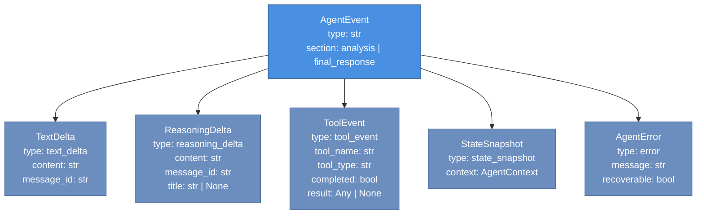

# parsimony-agents API Reference

**Version**: 0.1.0  
**Python**: 3.11 – 3.12  
**License**: Apache-2.0

This reference covers every public symbol exported from `parsimony_agents`. Internal helpers and private methods prefixed with `_` are excluded unless they appear in documented usage patterns.

---

## Public Exports

```python
from parsimony_agents import (
    Agent,
    AgentResult,
    Script,
    ScriptPreview,
    stream_to_display,
    display_result,
)
```

---

## Agent

```python
class Agent
```

The primary entry point. `Agent` runs an LLM-powered ReAct loop that writes and executes Python code to answer data questions. It yields structured events via an async generator and accumulates results via `ask()`.

### Constructor

```python
Agent(
    *,
    # Convenience parameters
    model: str | None = None,
    api_key: str | None = None,
    connectors: Any | None = None,
    # Full-control parameters
    model_config: dict[str, Any] | None = None,
    instructions: str | None = None,
    code_executor: BaseCodeExecutor | None = None,
    output_factory: OutputFactory | None = None,
    guardrails: AgentGuardrails = AgentGuardrails(),
    session_id: str | None = None,
    file_store: FileStore | None = None,
)
```

You must provide either `model` or `model_config`. Providing both raises `TypeError`.

#### Parameters

| Parameter | Type | Description |
|-----------|------|-------------|
| `model` | `str` | Any model string accepted by litellm, e.g. `"claude-sonnet-4-6"`, `"gpt-4o"`, `"gemini/gemini-3-flash-preview"`. Mutually exclusive with `model_config`. |
| `api_key` | `str` | API key forwarded to litellm. Use only with the `model` convenience form. Keys are never stored beyond the session. |
| `connectors` | `Connectors` | A `parsimony.Connectors` instance providing data sources the agent can fetch during execution. When provided, connector descriptions are appended to the system prompt automatically. |
| `model_config` | `dict` | Raw litellm completion kwargs. Supports any field litellm accepts: `model`, `api_key`, `api_base`, `temperature`, `max_tokens`, etc. Takes precedence over `model`. |
| `instructions` | `str` | Custom system prompt. Defaults to `DEFAULT_DATA_ANALYSIS_PROMPT`. When `connectors` is also set, connector descriptions are appended to the resolved instructions. |
| `code_executor` | `BaseCodeExecutor` | Custom executor implementation. Defaults to the in-process `CodeExecutor`. Supply this to use a remote sandbox or mock executor in tests. |
| `output_factory` | `OutputFactory` | Custom output factory for non-standard types (Polars, Arrow, etc.). Defaults to a factory writing parquet files to a temp directory. |
| `guardrails` | `AgentGuardrails` | Loop safety limits. See `AgentGuardrails` below. |
| `session_id` | `str` | Stable identifier for the session. Auto-generated UUID4 if omitted. Used to scope RAG stores when `file_store` is provided. |
| `file_store` | `FileStore` | Protocol providing `list_files()` and `get_files_dir()`. When set, the executor's working directory is set to the files directory on each run. |

#### Minimal example

```python
from parsimony_agents import Agent

agent = Agent(model="claude-sonnet-4-6")
result = await agent.ask("Compute the sum of 1..100 in Python")
print(result.text)
```

#### With connectors and full model config

```python
from parsimony_agents import Agent
from parsimony_agents.agent.config import AgentGuardrails
from parsimony.connectors.fred import CONNECTORS as FRED

agent = Agent(
    model_config={
        "model": "claude-sonnet-4-6",
        "api_key": "sk-ant-...",
        "temperature": 0.0,
        "max_tokens": 8192,
    },
    connectors=FRED.bind_deps(api_key="your-fred-key"),
    guardrails=AgentGuardrails(max_iterations=20, max_execution_time_s=120.0),
)
```

---

### Agent.ask()

```python
async def ask(
    self,
    message: str | Text,
    *,
    ctx: AgentContext | None = None,
    **kwargs: Any,
) -> AgentResult
```

Runs the agent and collects all streaming events into an `AgentResult`. This is the high-level interface. Use `run()` when you need per-event access.

#### Parameters

| Parameter | Type | Description |
|-----------|------|-------------|
| `message` | `str` or `Text` | The user's question or instruction. |
| `ctx` | `AgentContext` | Pass `result.context` from a previous `ask()` call to continue a multi-turn conversation. |

#### Returns

`AgentResult` — see below.

#### Example

```python
# Single turn
result = await agent.ask("What is the US unemployment rate?")
print(result.text)
print(result.datasets)  # {"unemployment": pd.DataFrame(...)}

# Multi-turn continuation
result2 = await agent.ask("Plot that as a line chart", ctx=result.context)
print(result2.charts)   # {"unemployment_chart": Chart(...)}
```

---

### Agent.run()

```python
async def run(
    self,
    user_message: str | Text,
    *,
    ctx: AgentContext | None = None,
    tool_choice: str = "auto",
) -> AsyncGenerator[AgentEventUnion, None]
```

Async generator yielding `AgentEvent` subtypes in real time. Use this when you need streaming access to tokens, tool progress, or state updates.

#### Parameters

| Parameter | Type | Description |
|-----------|------|-------------|
| `user_message` | `str` or `Text` | The user's question. |
| `ctx` | `AgentContext` | Context from a previous call for multi-turn sessions. |
| `tool_choice` | `str` | litellm tool choice. Default `"auto"`. |

#### Yields

`AgentEventUnion` — a discriminated union of all five event types. See **AgentEvent subtypes** below.

#### Example

```python
async for event in agent.run("What was GDP growth in 2023?"):
    match event.type:
        case "text_delta":
            print(event.content, end="", flush=True)
        case "tool_event" if not event.completed:
            print(f"\n[{event.tool_name}] starting...")
        case "tool_event" if event.completed:
            print(f"[{event.tool_name}] done: {event.ui_message_completed}")
        case "error":
            print(f"Error: {event.message}")
        case _:
            pass
```

---

## AgentResult

```python
@dataclass
class AgentResult
```

Structured result from a single `ask()` call. All fields are populated by accumulating events from the `run()` generator.

### Fields

| Field | Type | Description |
|-------|------|-------------|
| `text` | `str` | Concatenated LLM text from all `TextDelta` events. |
| `datasets` | `dict[str, Dataset]` | Returned datasets keyed by variable name. Populated when the agent calls `return_dataset`. |
| `charts` | `dict[str, Chart]` | Returned charts keyed by chart variable name. Populated when the agent calls `return_chart`. |
| `code` | `dict[str, Script]` | Notebook scripts keyed by notebook name. Populated from `StateSnapshot` events. |
| `context` | `AgentContext | None` | Final agent context. Pass to the next `ask()` call as `ctx=result.context` for multi-turn continuity. |
| `events` | `list[AgentEvent]` | Complete event log for the run. |

### Properties

| Property | Type | Description |
|----------|------|-------------|
| `ok` | `bool` | `True` if no `AgentError` events were emitted during the run. |

### AgentResult._collect()

```python
def _collect(self, event: Any) -> None
```

Accumulates a single event into the result. Call this inside a manual `run()` loop when you want both per-event access and a final structured result.

```python
result = AgentResult()
async for event in agent.run("question"):
    result._collect(event)
    # also handle the event yourself
    if event.type == "text_delta":
        print(event.content, end="")
# result is now fully populated
```

---

## AgentEvent Subtypes

All events extend `AgentEvent`:

```python
class AgentEvent(BaseModel):
    type: str
    section: Literal["analysis", "final_response"] = "analysis"
```

The `section` field partitions the stream into two phases. Read it on every event if your UI renders the analysis phase differently from the final response.

The diagram below shows the full event type hierarchy and the fields each subtype adds.



---

### TextDelta

Emitted for each streamed LLM text token.

```python
class TextDelta(AgentEvent):
    type: Literal["text_delta"]
    content: str        # token text
    message_id: str     # group tokens from the same LLM message
    delta: bool = True
```

Accumulate `content` grouped by `message_id` to reconstruct full messages.

---

### ReasoningDelta

Emitted for LLM reasoning tokens when the model supports extended thinking (e.g., `claude-3-7-sonnet-20250219`).

```python
class ReasoningDelta(AgentEvent):
    type: Literal["reasoning_delta"]
    content: str
    message_id: str
    title: str | None = None
    delta: bool = True
```

---

### ToolEvent

Emitted twice per tool call: once before execution (`completed=False`) and once after (`completed=True`).

```python
class ToolEvent(AgentEvent):
    type: Literal["tool_event"]
    tool_name: str
    tool_call_id: str
    tool_type: str          # "code" | "utility" | "return" | "system"
    completed: bool
    result: Any | None      # populated when completed=True
    ui_message: str | None  # pre-execution progress hint from the LLM
    ui_message_completed: str | None  # post-execution summary from the LLM
```

`ui_message_completed` is a past-tense summary the LLM writes when calling the tool (e.g., `"Fetched FRED/UNRATE"`). Display it as a progress label after the tool finishes.

---

### StateSnapshot

Emitted after each tool round with the full `AgentContext`. Use this to synchronize UI state.

```python
class StateSnapshot(AgentEvent):
    type: Literal["state_snapshot"]
    context: AgentContext
```

`context` contains the current variable store, notebooks, artifacts, and conversation history.

---

### AgentError

Terminal error event. When `recoverable=False`, the agent loop has stopped.

```python
class AgentError(AgentEvent):
    type: Literal["error"]
    message: str
    recoverable: bool = False
    error_type: str | None = None
```

---

## AgentGuardrails

```python
class AgentGuardrails(BaseModel)
```

Safety limits for the agent loop.

| Field | Type | Default | Description |
|-------|------|---------|-------------|
| `max_iterations` | `int` | `50` | Maximum number of LLM + tool round trips before the loop stops. |
| `max_execution_time_s` | `float` | `300.0` | Wall-clock time limit for the entire run in seconds. |
| `llm_timeout_s` | `float` | `60.0` | Per-LLM-call timeout in seconds. |
| `llm_max_retries` | `int` | `3` | Retries on rate-limit and transient errors before failing. |
| `tool_timeout_s` | `float` | `600.0` | Per-tool-call timeout in seconds. |

> **Known issue**: The default `tool_timeout_s` (600s) exceeds `max_execution_time_s` (300s), making individual tool timeouts unreachable under default settings. If you need per-tool timeouts to fire, set `tool_timeout_s` below `max_execution_time_s`.

---

## CodeExecutor

```python
class CodeExecutor(BaseCodeExecutor)
```

In-process stateful Python execution engine. Maintains a persistent locals dictionary across calls. Executes code via `exec()` and `eval()` with `threading.Lock` serialization.

### Constructor

```python
CodeExecutor(
    *,
    cwd: str,
    output_factory: OutputFactory,
    file_session_materializer: Callable[[str], Awaitable[None]] | None = None,
)
```

| Parameter | Type | Description |
|-----------|------|-------------|
| `cwd` | `str` | Working directory for code execution. The executor `os.chdir()` into this directory before each execution. |
| `output_factory` | `OutputFactory` | Converts execution outputs to typed `KernelOutputType` objects. |
| `file_session_materializer` | `Callable` | Optional async callable invoked when `set_cwd()` is called with a `session_id`. Use to materialize remote file sessions. |

### Base locals

The following names are pre-seeded into the execution namespace at construction:

| Name | Value |
|------|-------|
| `pd` | `pandas` |
| `np` | `numpy` |
| `alt` | `altair` |
| `datetime` | `datetime.datetime` |
| `timedelta` | `datetime.timedelta` |
| `timezone` | `datetime.timezone` |
| `__builtins__` | Python builtins |

When connectors are attached, `client` (the connector object) and `_fetch_log` (list) are also injected.

### Methods

#### execute()

```python
async def execute(
    self,
    code: str,
    dry_run: bool = False,
    timeout_seconds: float | None = None,
) -> KernelOutput
```

Executes `code` as a Python script block. `stdout`, `print()`, and `display()` calls are captured as structured outputs.

`dry_run=True` copies the locals before execution so the sandbox state is not modified. Use this for speculative or validation runs.

Returns a `KernelOutput` containing a list of typed `KernelOutputType` objects and a `fetch_log` list of recorded data fetches.

#### eval()

```python
async def eval(
    self,
    expr: str,
    dry_run: bool = False,
    timeout_seconds: float | None = None,
) -> KernelOutput
```

Evaluates a single Python expression and returns its value wrapped in a `KernelOutput`. Does not capture stdout.

#### push_state()

```python
async def push_state(self, data_context: SerializableContext) -> None
```

Merges `data_context.to_locals()` into the sandbox namespace without clearing existing locals. Called by the agent loop on session continuation to inject previously computed variables without re-running all prior code.

#### replace_state()

```python
async def replace_state(self, data_context: SerializableContext) -> None
```

Resets the sandbox to base locals and then seeds it with `data_context.to_locals()`. Also re-applies connectors and re-runs setup snippets. Called when the sandbox state may be stale.

#### get()

```python
async def get(self, key: str) -> KernelOutputType | None
```

Retrieves a named variable from the sandbox locals and converts it through the `OutputFactory`. Returns `None` if the key is not present.

#### execute_sql()

```python
async def execute_sql(self, sql_query: str) -> KernelOutput
```

Executes a SQL query against all `DataFrame` and `Series` in the current namespace via DuckDB. Requires the `[sql]` optional extra. Returns an `ImportError`-wrapped `KernelOutput` if DuckDB is not installed.

---

## OutputFactory

```python
class OutputFactory
```

Converts raw Python values produced during execution into typed `KernelOutputType` objects that the agent loop can serialize for the LLM and the frontend.

### Constructor

```python
OutputFactory(
    *,
    local_dir: str | Path,
    backend: StorageBackend | None = None,
)
```

`local_dir` is the directory for parquet file storage. `backend` is an optional remote storage protocol.

### OutputFactory.register()

```python
@classmethod
def register(cls, type_: type, handler: OutputHandler) -> None
```

Registers a handler for a custom Python type. Handlers run before built-in type checks, in registration order. A handler receives `(value, *, local_dir, backend)` and must return a `KernelOutputType`.

```python
import polars as pl
from parsimony_agents.execution.factory import OutputFactory
from parsimony_agents.execution.outputs import DataFrameObject
from parsimony_agents.execution.dataframe_ref import DataframeRef

OutputFactory.register(
    pl.DataFrame,
    lambda val, **kw: DataFrameObject(
        ref=DataframeRef.from_pandas(val.to_pandas(), ref="polars", **kw)
    ),
)
```

After registering, any `pl.DataFrame` returned from executed code is automatically converted to a `DataFrameObject`.

### Built-in type dispatch

| Python type | Output type |
|-------------|-------------|
| `pd.DataFrame`, `pd.Series` | `DataFrameObject` (stored as parquet via `DataframeRef`) |
| `alt.TopLevelMixin` | `FigureObject` (validated via vl-convert PNG render) |
| `str`, `int`, `float`, `bool`, `None` | `PrimitiveObject` |
| `np.generic` | `PrimitiveObject` (`.item()` called) |
| `Exception` | `ExceptionObject` (full traceback captured) |
| Any other type | `PrimitiveObject(str(value))` |

---

## KernelOutputType

The discriminated union of all structured output types:

```python
KernelOutputType = DataFrameObject | FigureObject | PrimitiveObject | ExceptionObject
```

### DataFrameObject

```python
class DataFrameObject(BaseOutputObject):
    type: Literal["dataframe"]
    ref: DataframeRef
```

Wraps a pandas DataFrame stored as a content-addressed parquet file. `DataFrameObject.value` materializes the parquet file on first access (lazy, cached).

Key computed fields: `head` (first 5 rows as JSON table), `tail` (last 5 rows, `None` for DataFrames with 10 or fewer rows).

### FigureObject

```python
class FigureObject(BaseOutputObject):
    type: Literal["figure"]
    value: alt.TopLevelMixin | dict[str, Any]
    name: str | None = None
    base64_image: str | None  # excluded from serialization
```

Wraps an Altair chart. `calc_base64_image()` renders the chart to PNG via vl-convert and caches the base64 result. The Parsimony theme (dark background, Ubuntu Mono, 640x400) is applied automatically.

### PrimitiveObject

```python
class PrimitiveObject(BaseOutputObject):
    type: Literal["primitive"]
    value: str | int | float | bool | None
```

Wraps scalar Python values.

### ExceptionObject

```python
class ExceptionObject(BaseOutputObject):
    type: Literal["exception"]
    value: str  # formatted traceback string
```

Wraps Python exceptions with full traceback text. The `value` field accepts `Exception` instances and converts them on validation.

### FetchLogEntry

```python
class FetchLogEntry(BaseModel):
    source: str
    source_description: str
    params: dict[str, Any]
    row_count: int
    column_names: list[str]
    columns: list[dict[str, Any]]
    provenance: Provenance
    head: dict[str, Any] | None   # nullable
    tail: dict[str, Any] | None   # nullable
```

Records a single data fetch performed inside the sandbox (via the `client` connector wrapper). `head` and `tail` are `None` when the dataset has 10 or fewer rows.

### KernelOutput

```python
class KernelOutput(MessageContent):
    type: Literal["kernel_output"]
    outputs: list[KernelOutputType]
    metadata: dict[str, Any] | None
    fetch_log: list[FetchLogEntry]
```

Container returned by `execute()` and `eval()`. `outputs` holds all captured values. `fetch_log` records data fetches performed during execution and is drained from executor locals on each call.

---

## VariableStore and Variable

### Variable

```python
class Variable(BaseModel):
    type: Literal["variable"]
    name: str
    output: KernelOutputType | None
    source: str
    source_description: str
    notebook_ref: str | None
    source_datasets: list[str]
    hidden: bool
    provenance: Provenance | None
    additional_metadata: list[MetadataItem]
```

A named output with provenance. Variables are the agent's working state — they live in the `VariableStore` and are injected into the LLM context block.

### VariableStore

```python
class VariableStore(BaseModel):
    type: Literal["variable_store"]
    variables: dict[str, Variable]
    version: int
```

Typed dictionary of named variables. Key methods:

| Method | Description |
|--------|-------------|
| `to_locals()` | Returns `{name: output.value}` dict for seeding the sandbox. Skips `ExceptionObject` and `None` outputs. |
| `extend(variables)` | Adds or replaces variables by name. |
| `increment_version()` | Increments `version` to signal state change. |

---

## Tool System

### @tool decorator

```python
def tool(
    name: str,
    description: str,
    parameters_schema: dict[str, Any],
    tool_type: Literal["code", "utility", "return", "system"],
    ui_message: str | None = None,
    ui_message_completed: str | None = None,
    ui_description: str | None = None,
) -> Callable[[Callable], Tool]
```

Wraps a free async function as a `Tool`. Use at module level for standalone tools.

```python
from parsimony_agents.tools import tool

@tool(
    name="fetch_weather",
    description="Fetch current weather for a city.",
    parameters_schema={
        "type": "object",
        "properties": {
            "city": {"type": "string", "description": "City name"},
        },
        "required": ["city"],
    },
    tool_type="utility",
)
async def fetch_weather(city: str, **kwargs) -> str:
    return f"Sunny in {city}"
```

### @toolmethod decorator

```python
def toolmethod(*args, **kwargs) -> Callable[[Callable], ToolMethod]
```

Same as `@tool` but for methods on a class. `ToolMethod` implements the descriptor protocol so that accessing the attribute on an instance returns a bound `Tool`.

### Tool types

| Type | Description |
|------|-------------|
| `code` | Writes or edits the active notebook Script. Prefixed `[CODE CELLS TOOL]` in the LLM schema. |
| `utility` | General helper operations: reading outputs, searching variables, fetching data. Prefixed `[UTILITY TOOL]`. |
| `return` | Terminates the agent loop by returning a `Dataset` or `Chart` artifact. Prefixed `[RETURN TOOL]`. |
| `system` | Context and session management. Prefixed `[SYSTEM TOOL]`. |

### _ui_message injection

Every tool schema automatically includes an optional `_ui_message` parameter. When the LLM populates it, the value appears in `ToolEvent.ui_message_completed` as a past-tense summary of what the tool did (e.g., `"Fetched FRED/UNRATE"`). Tool implementors do not need to handle this parameter explicitly — it is extracted by the agent loop before dispatching to the tool function.

---

## Script and ScriptPreview

```python
class Script(BaseModel):
    id: str
    # ... cells and metadata
```

Represents a named notebook of code cells. The agent writes to and edits `Script` objects in the `AgentContext`. Access scripts via `AgentResult.code[name]`.

```python
class ScriptPreview(BaseModel):
    # Lightweight summary of a Script for display
```

---

## Display Functions

### stream_to_display()

```python
async def stream_to_display(
    agent: Agent,
    message: str,
    *,
    ctx: AgentContext | None = None,
    show_code: bool = True,
    show_data: bool = True,
    ...
) -> AgentResult
```

Consumes `agent.run()` and renders a Rich terminal display with a spinner, live tool progress, syntax-highlighted code, and inline chart images. Falls back to plain text in non-TTY environments. Requires the `[display]` optional extra.

Returns an `AgentResult` identical to `agent.ask()`.

### display_result()

```python
def display_result(result: AgentResult, ...) -> None
```

Renders a completed `AgentResult` to the terminal. Use this when you have already collected the result and want to display it after the fact.

---

## Dataset and Chart Artifacts

### Dataset

```python
class Dataset(MessageContent):
    type: Literal["dataset"]
    artifact_id: str       # UUID5, stable: derived from variable_name + notebook_refs
    version: int
    variable_name: str
    variable_preview: dict[str, Any]
    title: str
    description: str
    notes: list[str]
    tags: list[str]
    notebook_refs: list[str]
```

Published dataset deliverable. `artifact_id` is a stable UUID5 derived from `variable_name` and `notebook_refs`. Renaming a variable produces a different `artifact_id`.

### Chart

```python
class Chart(MessageContent):
    type: Literal["chart"]
    artifact_id: str
    version: int
    title: str
    source_dataset_artifact_id: str
    source_dataset_variable_name: str
    source_dataset_version: int
    latest_source_dataset_version: int
    is_stale: bool             # True when source dataset has been updated
    chart_variable_name: str
    figure: FigureObject
    chart_notebook_ref: str
    description: str
    notes: list[str]
    last_refreshed_at: datetime | None
```

Published chart artifact wrapping a `FigureObject`. `is_stale` is `True` when the source dataset has been updated since the chart was generated.
